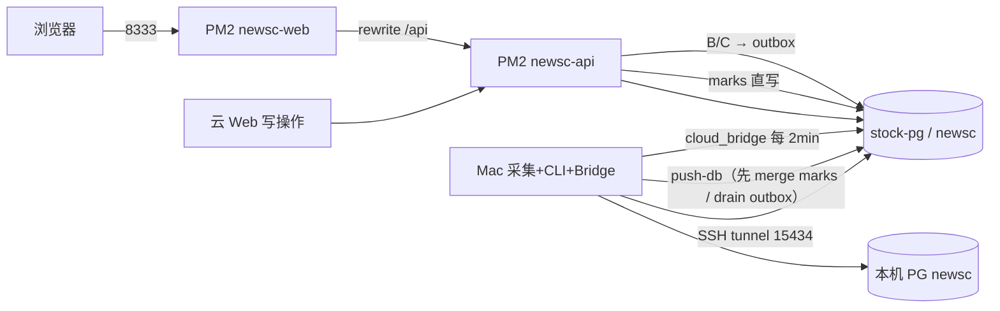

# NewsC 混合部署与云端运维

> 模式：Mac 采集真源 → 推云；云端可操作（星标/订阅/同步指令）经 outbox 回写 Mac。

## 1. 主机与入口

| 项 | 值 |
|----|-----|
| 主机 | `120.25.145.131` |
| 路径 | `/opt/newsc` |
| Web | `http://120.25.145.131:8333` |
| API | 同源 `http://120.25.145.131:8333/api/*`（Next rewrite → `127.0.0.1:8787`） |
| PM2 | `newsc-api` · `newsc-web` |
| PG | 共用 `stock-pg` · `127.0.0.1:5432` · 库 `newsc` |
| 隧道本机端口 | `15434` |
| cron | `/etc/cron.d/newsc`（仅 `verify-cloud`） |

同机对照：stock `:8899` · FlowLedger `:8900` · NewsC `:8333`。

## 2. 架构



## 3. 安全组与纪律

- 放行：`8333`、SSH；**不放行** `5432` / `8787`
- **禁止**再起独立 PG 容器；对 `stock-pg` 只增库、不无备份重建
- 云端 **禁止** 直接跑 `pipeline run` / `ai process` 写业务表（改为 outbox → Mac）
- 云 Web **允许** 星标/订阅/同步配置：marks 直写云库；订阅与行动写入 `cloud_outbox`，由 Mac Agent 应用
- **日报**：本机入库（`digest_vault_*`）后随推库上云；云端目录不可读时读库

### 控制面（A/B/C）

| 类 | 云端行为 | Mac 行为 |
|----|----------|----------|
| A 星标/已读 | 写 `marks` | `cloud_bridge` / push 前按 `updated_at` 合并 |
| B 订阅/vault | 写云库 + `cloud_outbox` | Agent 应用到本机库 / yml |
| C 推库/隧道/采集 | 只入 outbox | Agent 执行脚本或本机 API |

```bash
# 安装控制面 Agent（推荐）
bash scripts/deploy/install-cloud-bridge-launchd.sh
# 手动拉一次
bash scripts/deploy/pull-cloud-control.sh
```

## 4. 日常命令

```bash
# 首次 / 全量部署
bash scripts/deploy/deploy-aliyun.sh

# 仅更新代码与进程（跳过建库）
SKIP_DB=1 bash scripts/deploy/deploy-aliyun.sh

# Mac → 云 推库 + vault
bash scripts/deploy/db-tunnel.sh -d
bash scripts/deploy/push-db-to-cloud.sh

# 仅 dry-run（不写云）
bash scripts/deploy/push-db-to-cloud.sh --dry-run

# 安装本机定时推送（读 .env.cloud.local 的 PUSH_SCHEDULE_*）
bash scripts/deploy/install-push-db-launchd.sh
bash scripts/deploy/install-push-db-launchd.sh uninstall

# 云端日志
ssh root@120.25.145.131 'pm2 logs newsc-api --lines 80'
ssh root@120.25.145.131 'bash /opt/newsc/scripts/deploy/verify-cloud.sh'
```

本机密钥（gitignore）：`.env.cloud.local`、`/tmp/newsc-deploy/pg_pass.txt`、`/tmp/newsc-deploy/api_token.txt`。

定时推送字段（也可在设置页配置）：

| 变量 | 说明 |
|------|------|
| `PUSH_SCHEDULE_ENABLED` | `1` 启用 / `0` 关闭 |
| `PUSH_SCHEDULE_MODE` | `daily` 每日定点 · `interval` 按小时间隔 |
| `PUSH_SCHEDULE_TIMES` | 默认 `09:00,12:00,16:00,20:00` |
| `PUSH_SCHEDULE_INTERVAL_HOURS` | 间隔小时数（1–168） |

## 5. 脚本清单

| 脚本 | 作用 |
|------|------|
| `scripts/deploy/deploy-aliyun.sh` | rsync + 建库 + PM2 |
| `scripts/deploy/db-tunnel.sh` | SSH 隧道 `15434` |
| `scripts/deploy/push-db-to-cloud.sh` | 先 merge marks + drain outbox → vault ingest → pg_dump → 云 |
| `scripts/deploy/pull-cloud-control.sh` | Mac 拉 marks + 消费 outbox |
| `scripts/deploy/install-cloud-bridge-launchd.sh` | 每 2 分钟控制面 Agent |
| `scripts/deploy/sync-vault-to-cloud.sh` | 可选文件 rsync（`SYNC_VAULT_FILES=1`） |
| `python -m pipeline.vault_ingest` | 本机日报目录写入 DB |
| `scripts/deploy/verify-cloud.sh` | 云端只读巡检 |
| `scripts/deploy/install-linux-cron.sh` | 云 cron |
| `scripts/deploy/install-push-db-launchd.sh` | Mac LaunchAgent |

*文档版本：2026-08-12 · 首次混合部署脚手架*
